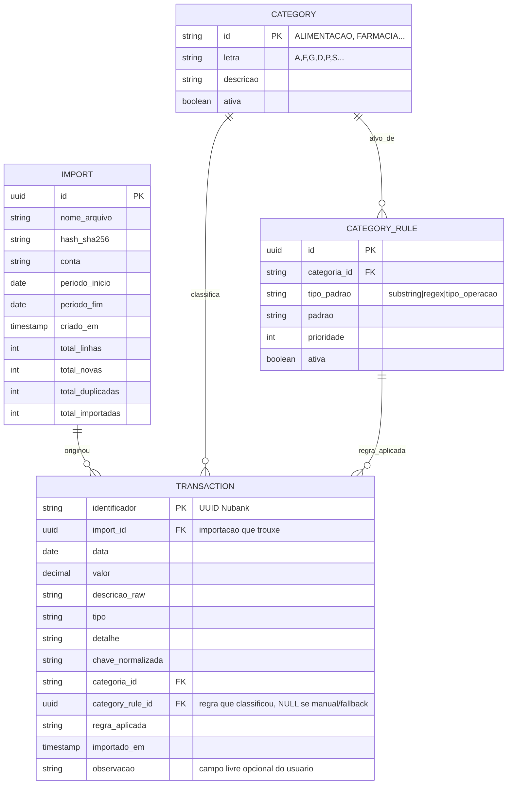
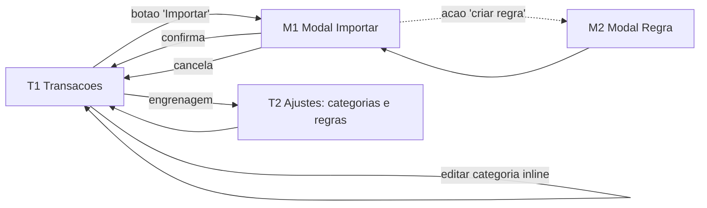

# Planejamento — Sistema de Categorizacao de Extratos

Sistema para ingerir extratos CSV do Nubank (formato descrito em [PLANO.md](../PLANO.md)),
classificar transacoes via dicionario + heuristicas, oferecer preview interativo de
selecao e persistir o que o usuario aprovar em um banco relacional, organizado por mes.

Este documento foca em **modelo de dados** e **funcionalidades**. Stack, UI e infra
ficam abertos.

---

## 1. Conceitos do dominio

- **Importacao** (`Import`): uma execucao de "subir um CSV". Um arquivo CSV gera **uma**
  importacao. Carrega metadados de origem (nome do arquivo, conta, periodo extraido do
  nome, hash, contadores).
- **Transacao** (`Transaction`): linha do extrato. Chave primaria = `Identificador` do
  Nubank (UUID v4). Mesmo `Identificador` pode aparecer em multiplos arquivos
  (sobreposicao de periodos) — o sistema deduplica.
- **Preview**: estado transitorio em memoria (na sessao/cliente) com o resultado do
  parser + categorizacao sugerida. Nao persiste no banco. So vira `Transaction` no
  momento da confirmacao.
- **Categoria** (`Category`): codigo canonico (`ALIMENTACAO`, `FARMACIA`, etc.).
  Possui letra curta opcional (`A`, `F`, ...) usada no agrupamento para a planilha.
- **Regra de categorizacao** (`CategoryRule`): par `(padrao, categoria)` que permite
  ao usuario manter o dicionario sem editar codigo. Substitui o atual
  `merchants_para_classificar.csv` + `autofill_categorias.py:REGRAS`.

---

## 2. Modelo de dados



### 2.1 Decisoes-chave

- **PK de `TRANSACTION` = `identificador` (UUID do Nubank)**: deduplicacao natural,
  sem coluna sintetica. Conflito em INSERT = ja foi importada.
- **Preview e in-memory**: parsing + categorizacao rodam por requisicao e devolvem
  o resultado para o cliente. Nada e gravado ate a confirmacao. Se a sessao expirar,
  basta reenviar o arquivo — o resultado e deterministico.
- **`IMPORT` so e criada na confirmacao**: nao existem importacoes "em rascunho" no
  banco. Isso elimina estados intermediarios (`PENDING`/`PREVIEWED`/`CANCELLED`).
- **Sem tabela `MONTH`**: agrupamento por mes e feito pela UI/consulta a partir do
  campo `data`. Indice em `(data)` mantem o agrupamento barato.
- **`CATEGORY_RULE`** substitui o CSV manual. Permite UI para criar/editar regras e
  reaproveitar a logica do `chave_agrupamento` + `match` por substring.

### 2.2 Indices recomendados

- `TRANSACTION(data)` — listagens por mes/periodo.
- `TRANSACTION(categoria_id, data)` — relatorios.
- `TRANSACTION(chave_normalizada)` — busca/agrupamento por merchant.
- `CATEGORY_RULE(ativa, prioridade)` — ordem de aplicacao.

### 2.3 Migracoes — regra obrigatoria

Toda mudanca no schema (tabelas, colunas, indices, constraints, enums) **exige
uma migracao versionada** gerada pela ferramenta do ORM (Drizzle Kit) e
commitada junto com a alteracao do schema. Fluxo:

1. Editar `apps/api/src/db/schema.ts`.
2. Gerar a migracao: `pnpm drizzle-kit generate`.
3. Revisar o SQL gerado em `apps/api/src/db/migrations/`.
4. Aplicar localmente: `pnpm drizzle-kit migrate`.
5. Commitar schema + migracao + seeds/data fixes no mesmo commit.

Proibido: alterar banco direto via SQL manual, usar `drizzle-kit push` em
producao, ou editar migracoes ja aplicadas em ambientes compartilhados (para
corrigir, criar nova migracao).

---

## 3. Funcionalidades (visao do usuario)

### 3.1 Upload e parsing (in-memory)

1. Usuario seleciona um arquivo CSV de extrato.
2. Backend valida formato (header esperado, encoding UTF-8) e calcula
   `hash_sha256` do conteudo bruto.
3. Se ja existir uma `Import` com mesmo `hash_sha256` → avisar "esse arquivo ja
   foi importado em DD/MM/AAAA", mas seguir mostrando o preview (o usuario decide
   se ainda importa transacoes novas que por acaso existam).
4. Extrair metadados do nome (`conta`, `periodo_inicio`, `periodo_fim`).
5. Devolver ao cliente: metadados + lista de itens parseados (ja categorizados).
   Nenhuma gravacao ainda.

### 3.2 Categorizacao automatica

Para cada linha do CSV, em memoria:

1. Parse: `data`, `valor`, `identificador`, `descricao_raw`, `tipo`, `detalhe`,
   `chave_normalizada` (mesma logica do `bootstrap_merchants.chave_agrupamento`).
2. Verificar se `identificador` ja existe em `TRANSACTION` → marcar item com flag
   `ja_existente=true` (so para a UI; o item ainda aparece no preview com aviso).
3. Resolver categoria pela cascata:
   - regra ativa de `CATEGORY_RULE` por ordem de prioridade → match em
     `chave_normalizada`;
   - `TIPOS_AUTOMATICOS` (Pix/transferencia → `PIX`);
   - heuristicas embutidas (fallback do `autofill_categorias`);
   - senao `OUTROS`.
4. Anexar ao item: `categoria_sugerida`, `category_rule_id` (se veio de regra),
   `regra_aplicada`.

### 3.3 Preview e selecao

Tela mostra a lista de itens do parser, agrupada por dia, com colunas:
`data | descricao_raw | valor | categoria_sugerida | regra | acao`.

O estado da selecao vive no cliente. Acoes possiveis por linha:

- **Importar/Ignorar** (toggle `selecionado`).
- **Trocar categoria** inline (dropdown de categorias ativas) → sobrescreve
  `categoria_sugerida`, marca regra como `manual`.
- **Criar regra a partir desta linha**: usa `chave_normalizada` como padrao e a
  categoria escolhida como alvo. Esta acao **persiste imediatamente** em
  `CATEGORY_RULE` (e independente da importacao). Opcional: reaplicar nos demais
  itens do preview atual.

Acoes em lote:

- Selecionar/desmarcar todos.
- Selecionar todos de uma categoria.
- Marcar todos `ja_existente=true` como ignorados (default razoavel).

### 3.4 Confirmacao da importacao

Request do cliente envia para o backend: metadados do arquivo + lista dos itens
selecionados (com a categoria final escolhida por linha).

Backend executa em uma transacao:

1. Cria `IMPORT` com os contadores ainda zerados.
2. Para cada item selecionado: tenta INSERT em `TRANSACTION` (PK = `identificador`).
   Em caso de conflito (re-importacao): ignorar e contar como duplicada.
3. Atualiza `IMPORT` com `total_linhas`, `total_novas`, `total_duplicadas`,
   `total_importadas`.
4. Retorna o resumo para a UI.

### 3.5 Cancelar

Nao existe estado a limpar: basta o cliente descartar o preview. Nada chegou ao
banco.

### 3.6 Consulta por mes

- Lista de meses derivada de `SELECT date_trunc('month', data) ... GROUP BY 1`,
  com totais de entrada/saida calculados sob demanda.
- Drilldown: transacoes do mes com filtros por categoria, busca textual em
  `descricao_raw`/`detalhe`.
- Exportacao do mes em CSV no mesmo formato simplificado de hoje
  (`[CATEGORIA] descricao, valor`) para colar na planilha.

### 3.7 Manutencao de regras e categorias

- CRUD de `Category` (nao deletar, so desativar) — id imutavel, letra/descricao
  editaveis.
- CRUD de `CategoryRule` com teste em tempo real: ao digitar o padrao, mostrar
  quantas transacoes ja persistidas cairiam nessa regra.
- Acao "reclassificar historico": aplica regras ativas a transacoes existentes
  (com confirmacao, mostrando diff antes).

### 3.8 Auditoria

- `Import.criado_em` + `Transaction.importado_em` para rastrear origem.
- `Transaction.regra_aplicada` + `category_rule_id` preservam o motivo da
  classificacao (mesmo que a regra seja deletada depois, manter o id por
  historico — soft delete em `CategoryRule.ativa`).

### 3.9 Edicao pos-importacao

- Usuario pode editar a `categoria_id` de uma `TRANSACTION` ja persistida e o
  campo livre `observacao`.
- A edicao limpa `category_rule_id` e marca `regra_aplicada = "manual"`.
- Demais campos (data, valor, identificador, descricao_raw, etc.) sao imutaveis
  — vieram do extrato e nao devem ser alterados.

---

## 4. Pontos em aberto

- **Multi-conta / multi-usuario**: hoje so existe a conta `941505780`. Se virar
  multi-usuario, adicionar `User` e escopar `Import`/`Transaction`/`Category`.
- **Regras: substring vs regex**: `CATEGORY_RULE.tipo_padrao` pode aceitar dois
  modos de matching contra `chave_normalizada`:
  - `substring` (default): regra casa se `padrao` aparecer dentro da chave. Ex.:
    padrao `POSTO PELANDA` casa com `AUTO POSTO PELANDA LTD`. Cobre 95% dos
    casos e e simples de criar pela UI.
  - `regex`: casamento por expressao regular. Necessario quando a regra tem que
    distinguir variantes que o substring nao consegue (ex.: capturar so `RAIA`
    seguido de digitos e nao "RAIANE"). Decidir se vale a complexidade extra ou
    se da pra viver so com substring.

---

## 5. Stack proposta

Tudo fullstack JavaScript/TypeScript, monorepo simples.

### 5.1 Resumo

| Camada       | Escolha                                   | Por que                                                              |
| ------------ | ----------------------------------------- | -------------------------------------------------------------------- |
| Banco        | **PostgreSQL** 16+                        | Relacional maduro, `ON CONFLICT DO NOTHING` resolve a dedupe por PK. |
| Backend      | **Node.js + Fastify** em TypeScript       | Rapido, schema validation nativo, ecossistema enorme.                |
| ORM          | **Drizzle ORM**                           | Migrations em TS, queries tipadas, sem mistica de runtime.           |
| Validacao    | **Zod**                                   | Compartilhada entre back e front (DTOs unicos).                      |
| Upload CSV   | `@fastify/multipart` + `papaparse`        | Streaming, lida com UTF-8 e quoting do CSV do Nubank.                |
| Frontend     | **Vue 3** + Vite + TypeScript             | Pedido do usuario; SFC + Composition API.                            |
| UI           | **PrimeVue** (ou Vuetify)                 | DataTable com selecao, edicao inline e filtros prontos.              |
| Estado       | **Pinia**                                 | Store oficial Vue 3, simples.                                        |
| HTTP cliente | `fetch` + wrapper fino, ou `@tanstack/vue-query` | Cache de queries + invalidacao quando vier paginacao/listagens. |
| Testes       | **Vitest** (front e back)                 | Mesmo runner nos dois lados, configuracao minima.                    |

### 5.2 Por que Fastify (e nao Express/Nest)

- **Fastify**: schema-first com JSON Schema, validacao e serializacao
  automaticas, ~2x mais rapido que Express. Plugins maduros para multipart,
  CORS, JWT. Curva de aprendizado curta.
- **Express**: aceitavel, mas obriga middleware manual para validacao e nao
  serializa por schema. Mais codigo boilerplate.
- **NestJS**: poderoso, mas overkill para um sistema com ~6 tabelas e uma tela
  principal. DI/decorators adicionam complexidade que aqui nao paga.

Se preferir algo ainda mais minimo, **Hono** tambem e uma boa (especialmente se
quiser deploy em edge runtimes no futuro).

### 5.3 Por que Drizzle (e nao Prisma/Knex)

- **Drizzle**: schema em TS puro, migrations geradas a partir do schema, SQL
  proximo ao real. Sem processo separado de geracao de cliente. Bundle pequeno.
- **Prisma**: otimo DX, mas exige cliente gerado e tem um runtime mais pesado;
  migrations sao um arquivo `.sql` cego ao schema.
- **Knex**: query builder sem tipagem forte; daria mais trabalho.

### 5.4 Layout do repositorio

```
financeiro/
  apps/
    api/                  # Fastify + Drizzle
      src/
        routes/
        services/         # parser, categorizador (porte do Python)
        db/               # schema, migrations
        index.ts
    web/                  # Vue 3 + Vite
      src/
        views/
        components/
        stores/
        api/
  packages/
    shared/               # DTOs Zod + tipos compartilhados
  docker-compose.yml      # Postgres local
  package.json            # workspaces (pnpm ou npm)
```

### 5.5 Fluxo do upload no novo stack

1. `web` envia o arquivo via `POST /imports/preview` (multipart).
2. `api` faz parsing com `papaparse` (streaming), aplica categorizacao em
   memoria (porte do `bootstrap_merchants.py` + `autofill_categorias.py` para
   TS), e devolve JSON: `{ metadados, itens: [...] }`.
3. `web` mostra na DataTable, usuario seleciona/edita.
4. `web` envia `POST /imports/confirm` com `{ metadados, itensSelecionados[] }`.
5. `api` abre transacao, cria `IMPORT` e faz `INSERT ... ON CONFLICT DO NOTHING`
   nas `TRANSACTION`s. Retorna o resumo.

Operacoes de CRUD de `Category`/`CategoryRule` e consultas por mes ficam em
rotas REST padrao (`GET /transactions?from=&to=&category=`).

### 5.6 Postgres local

Subir com Docker:

```yaml
# docker-compose.yml
services:
  db:
    image: postgres:16-alpine
    environment:
      POSTGRES_USER: financeiro
      POSTGRES_PASSWORD: financeiro
      POSTGRES_DB: financeiro
    ports: ["5432:5432"]
    volumes: ["pg:/var/lib/postgresql/data"]
volumes: { pg: {} }
```

---

## 6. Telas (UI)

Planejamento de telas antes de codar: definir **inventario**, **fluxo de
navegacao** e **wireframe textual** (campos, acoes, estados) de cada uma. Serve
de checklist de backlog e de contrato entre back e front.

### 6.1 Inventario

Filosofia: **uma tela principal**. Tudo mais e modal/drawer chamado a partir
dela. Importacao tambem e modal (multi-step), nao rota separada.

| #  | Tela / overlay        | Tipo            | Proposito                                                       |
| -- | --------------------- | --------------- | --------------------------------------------------------------- |
| T1 | Transacoes            | rota `/`        | Tabela com filtros no topo; ponto unico de visualizacao.        |
| M1 | Importar              | modal (3 steps) | Upload → preview → resultado, tudo dentro do mesmo dialogo.     |
| M2 | Criar/editar regra    | modal pequeno   | Acionado pela acao "criar regra" no preview ou pelo gerenciador.|
| T2 | Categorias e regras   | rota `/ajustes` | CRUD secundario (acessivel via menu/engrenagem).                |

### 6.2 Fluxo de navegacao



### 6.3 Wireframe — T1 Transacoes (tela principal)

```
+-------------------------------------------------------------------------------+
| Financeiro                                          [ Importar ]   [ ⚙ ]      |
+-------------------------------------------------------------------------------+
| Periodo: [ Jun/2026  v ]   Categorias: [ Todas v ]   Busca: [____________]    |
| Tipo: [ Todos v ]   Valor: [ min ] - [ max ]                       [ Limpar ] |
+-------------------------------------------------------------------------------+
|   Saidas: -R$ 6.123,45    Entradas: R$ 10.000,00    Saldo: R$ 3.876,55        |
+-------------------------------------------------------------------------------+
| Data        | Descricao                                  | Valor   | Cat | Obs|
|-------------|--------------------------------------------|---------|-----|----|
| 01/06/2026  | Compra no debito - SUPERMERCADO CRUZ       | -82,80  | [A] |    |
| 01/06/2026  | Compra no debito - R13 ESTACIONAMENTO      | -15,00  | [T] |    |
| 03/06/2026  | Transf. Recebida - FARUK MUSTAFA...        | 10.000  | [P] |    |
| ...                                                                            |
+-------------------------------------------------------------------------------+
| 32 transacoes  •  [ Exportar CSV ]                                            |
+-------------------------------------------------------------------------------+
```

- **Proposito**: visualizar, filtrar e curar transacoes em um lugar so.
- **Filtros (topo)**: periodo (default = mes atual; opcoes "ultimos 30 dias",
  meses anteriores, custom), categorias (multi-select), busca textual em
  `descricao_raw`/`detalhe`, tipo de operacao, faixa de valor. Botao "Limpar".
- **Resumo (linha abaixo dos filtros)**: total entradas, total saidas, saldo,
  recalculado conforme filtros.
- **Tabela**: `data | descricao | valor | categoria (badge + dropdown inline)
  | observacao (input inline)`. Ordenacao por data; clique no header reordena.
- **Paginacao**: virtual scroll OU "carregar mais" — decidir no protótipo.
- **Acoes globais**: `Importar` (abre M1), `Exportar CSV` (formato simplificado),
  engrenagem (vai para T2).
- **Estados**: vazio inicial = "Nenhuma transacao ainda. Clique em Importar
  para subir um extrato do Nubank."
- **Endpoints**: `GET /transactions?from=&to=&category=&q=&minValue=&maxValue=`,
  `PATCH /transactions/:id`, `GET /transactions/export`.

### 6.4 Wireframe — M1 Modal Importar

Modal multi-step (3 passos no mesmo dialogo, sem trocar de rota).

#### Step 1 — Upload

```
+-------------------- Importar extrato -------------------+
|                                                          |
|  +--------------------------------------------------+    |
|  |  Arraste o CSV aqui ou [ Selecionar arquivo ]    |    |
|  +--------------------------------------------------+    |
|                                                          |
|  Arquivo: NU_941505780_01JUN2026_07JUN2026.csv           |
|  Conta:    941505780                                     |
|  Periodo:  01/06/2026 a 07/06/2026                       |
|  Tamanho:  4,2 KB                                        |
|                                                          |
|  [Cancelar]                            [Analisar →]      |
+----------------------------------------------------------+
```

- Erros de formato/encoding aparecem inline.
- Se o hash do arquivo ja existir em `IMPORT` → mostra banner amarelo "este
  arquivo ja foi importado em DD/MM/AAAA", mas botao `Analisar` segue habilitado
  (pode ter linhas novas mesmo assim).

#### Step 2 — Preview

```
+-------------------- Importar extrato (Preview) --------------------+
|  32 linhas no arquivo • 5 ja existem • 9 sem categoria (OUTROS)    |
|                                                                     |
|  [✓] Selecionar todas    [ ] Ignorar ja existentes                  |
|                                                                     |
| [✓] Data       | Descricao                  | Valor   | Categoria  |
|-----|----------|----------------------------|---------|------------|
| [✓] 01/06     | SUPERMERCADO CRUZ           | -82,80  | [A v]  ⓘ  |
| [ ] 01/06     | (ja existe) BURGER KING     | -58,80  | [A v]      |
| [✓] 05/06     | DIVINO FOGAO-COMIDA D       | -46,98  | [S v]  + |
|                                                                     |
|  Selecionadas: 27 / 32                                              |
|  [← Voltar]      [Cancelar]              [Confirmar importacao]    |
+---------------------------------------------------------------------+
```

- Coluna `ⓘ` mostra origem da categoria (dicionario / heuristica / fallback).
- Botao `+` ao lado do dropdown abre M2 (criar regra a partir desta linha).
- Linhas `ja_existente` vem desmarcadas por padrao com badge "ja existe".
- Contadores no topo refletem selecao em tempo real.
- Estado vive no cliente; aviso ao tentar fechar com selecao nao confirmada.

#### Step 3 — Resultado

```
+-------------------- Importacao concluida --------------------+
|                                                               |
|  ✓ 27 transacoes importadas                                   |
|  • 5 duplicadas (ignoradas)                                   |
|  • 0 erros                                                    |
|                                                               |
|  Meses afetados: Jun/2026                                     |
|                                                               |
|  [Importar outro]                              [Fechar]       |
+---------------------------------------------------------------+
```

- Fechar volta para T1 ja com o filtro setado para o(s) mes(es) afetado(s).
- Erro de gravacao = mostra mensagem + permite retry sem perder a selecao.

**Endpoints do modal**: `POST /imports/preview` (multipart),
`POST /imports/confirm`, `POST /rules` (via M2).

### 6.5 Wireframe — M2 Modal Criar/editar regra

Pequeno, focado:

```
+------------------ Nova regra ------------------+
| Padrao: [ POSTO PELANDA            ]           |
| Tipo:   ( • ) substring   ( ) regex            |
| Categoria: [ TRANSPORTE v ]                    |
| Prioridade: [ 100 ]                            |
|                                                |
| Preview: 3 chaves existentes casariam          |
|   - AUTO POSTO PELANDA LT                      |
|   - AUTO POSTO PELANDA LTD                     |
|   - PARADA PEDRO PELANDA                       |
|                                                |
|  [ ] Reaplicar nas linhas do preview atual     |
|  [ ] Reclassificar historico                   |
|                                                |
| [Cancelar]                            [Salvar] |
+------------------------------------------------+
```

- Preview ao vivo: `GET /rules/preview?padrao=&tipo=`.
- "Reclassificar historico" mostra diff antes de aplicar.

### 6.6 Wireframe — T2 Ajustes (categorias e regras)

Tela secundaria simples, dois tabs:

- **Tab Categorias**: tabela `id | letra | descricao | ativa | usos`.
  Acoes: criar, editar inline, desativar.
- **Tab Regras**: tabela `padrao | tipo | categoria | prioridade | ativa |
  qtd casaria`. Acoes: criar (abre M2), editar, desativar, reordenar
  prioridade por drag.

### 6.7 Componentes reutilizaveis

- **CategoryBadge**: pill com `letra` + tooltip com `descricao`.
- **MoneyCell**: valor pt-BR, negativos em vermelho.
- **CategoryPicker**: dropdown com busca, usado inline na tabela e nos forms.
- **TransactionsTable**: a tabela da T1 e do step Preview da M1 sao o mesmo
  componente com colunas configuraveis (checkbox so no preview).
- **PeriodPicker**: select de periodo com presets + range custom.

### 6.8 Validacao do design antes de codar

Antes de implementar cada tela/modal:

1. **Mock estatico** (Excalidraw ou tabela ASCII no doc) para validar layout.
2. **Lista de endpoints** que consome → confirmar contra `packages/shared`.
3. **Lista de estados** (vazio, loading, erro, sem resultado) → garantir
   mensagem amigavel em todos.
4. **Atalhos de teclado** desejaveis no modal de importar:
   `space` toggle selecao, `enter` confirma, `esc` fecha.

